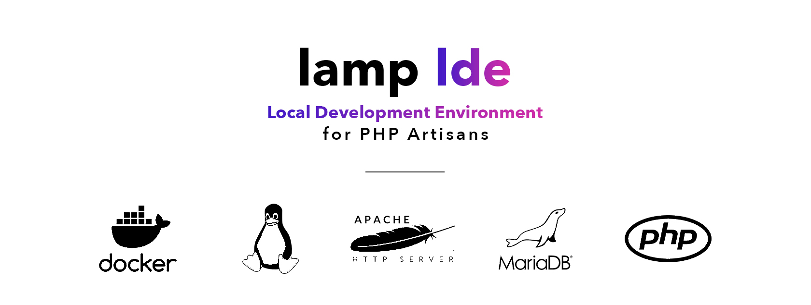

<div align="center">
  
  <p></p>
  <h1>LAMP Local Development Environment on Docker</h1>
  <p></p>
  <p align="center">
    <a href="#-intro"><b>What is this?</b></a>
    &nbsp;&nbsp;&mdash;&nbsp;&nbsp;
    <a href="#installation-"><b>Installation</b></a>
    &nbsp;&nbsp;&mdash;&nbsp;&nbsp;
    <a href="#common-commands-"><b>Usage</b></a>
    &nbsp;&nbsp;&mdash;&nbsp;&nbsp;
    <a href="#further-reading"><b>Docs</b></a>
  </p>
  <br />
</div>

__An everyday local development environment for PHP Developers.__ At [Pivotal Agency](https://pivotal.agency), we've done a _buuunnnch_ of R&D to find the best local dev tools for our team. This is the result of our hard work. This tool has been put to its paces everyday by our team, we hope it can also help yours.

---

## Intro 👋

This is a set of Docker images to spin up a LAMP stack (Linux, Apache, MySQL and PHP) for developing locally. It's perfect for local development because you can very simply add new sites to specified directory and they're magically accessible as a subdomain of your chosen hostname (eg. eg. `~/Sites/info` maps to `http://info.localhost/`).

It includes all the required dependencies for everyday PHP development with common tools like Laravel, Wordpress and Magento (1 & 2). Specifically:

*Default:*

- Apache
- PHP 8.0
    - Composer (latest)
    - Node.js (16.x) & NPM (latest)*
    - Yarn (latest)*
    - PHPCS (with Wordpress code standards added)*
    - Wordpress CLI*
    - ZSH*
- Mailhog (latest)
- MariaDB 10.3

*Optional:*

- PHP 5.6, 7.0, 7.1, 7.2, 7.3 and 7.4
- Memcached 1.x
- Redis 6.x
- HTTPS (SSL for localhost)
- [Blackfire](https://blackfire.io/) (latest)

<p><i>* Available in latest 2x PHP containers</i></p>

The environment features clever *domain mapping* to allow you to run code for various platforms. Sites are accessible from the following URLs (by default it's `http://<website>.localhost`, however `APACHE_HOSTNAME` can modified in `.env` to point to a different hostname):

* __http://classic-php.php56.{APACHE_HOSTNAME}__ (eg. http://classic-php.php56.localhost)
    * Will map to `~/Sites/classic-php` and use PHP 5.6
* __http://laravel.php70.pub.{APACHE_HOSTNAME}__
    * Will map to `~/Sites/laravel/public` and use PHP 7.0
* __http://php-project.php80.{APACHE_HOSTNAME}__
    * Will map to `~/Sites/php-project` and use PHP 8.0
* __http://another-project.{APACHE_HOSTNAME}__
    * Will map to `~/Sites/another-project` and use the default version of PHP (currently 7.4)

---

## Prerequisites ⚠️

* Your machine must be running MacOS, Windows 10 _Pro_ or Linux
* Your CPU must support virtualisation (Intel VT-x or AMD-V)
* You must have [Docker Compose](https://docs.docker.com/compose/install/) (version 1.25.0+) and Docker installed & running

---

## Installation 🚀

```bash
# Clone the repo
git clone https://github.com/pvtl/docker-dev && cd docker-dev

# Create & update relevant config - For example:
#  - Point sites to your sites directory
#  - Set user/group ID's
#  - Add optional services (eg. extra PHP versions, PHPMyAdmin, Memcached etc)
cp .env.example .env

# Start the environment
docker-compose up -d

# The containers are now running. You can now:
# - Open a website in your browser using <DIRECTORY NAME>.{APACHE_HOSTNAME} (see domain mapping notes above)
# - Open a terminal window into one of the containers, via `docker-compose exec <CONTAINER NAME> bash`
```

---

## Updating 🔄

Open a terminal window, browse to this project's folder and run:

```bash
# 1. Pull from Git
git pull
# 2. Erase previous containers
docker-compose down --remove-orphans
# 3. Get latest docker images
docker-compose pull
# 4. Rebuild Dockerfiles from scratch (inc. pull parent images)
docker-compose build --pull --no-cache --parallel
# 5. Start the new env
docker-compose up -d
# 6. Erase any unused containers, images, volumes etc. to free disk space.
docker system prune --volumes
```

*This will also install the latest versions of all tools (eg. PHP, Redis, Node.js etc.)*

---

## Common Commands 🔥

The Docker Engine must be running and commands must be run within this repo's root.

| Command | Description |
|---|---|
| `docker-compose start` | Start all containers |
| `docker-compose stop`  | Stop all containers (keeps any config changes you've made to the containers) |
| `docker-compose up -d --build --no-cache` | Recreate all containers from scratch |
| `docker-compose down`  | Tear down all containers (MySQL data and Project files are kept) |
| `docker-compose exec php80-fpm zsh`  | Open a zsh terminal in the PHP 8.0 container |
| `docker-compose logs php80-fpm` | View all logs for PHP-FPM 8.0 |
| `docker-compose ps` | Show which containers are running |

---

## Further Reading

- 🚥 [Connections](docs/connections.md)
    - [Email](docs/connections.md#Email)
    - [MySQL](docs/connections.md#MySQL)
    - [XDebug](docs/xdebug.md)
    - [Redis](docs/connections.md#Redis)
    - [Memcached](docs/connections.md#Memcached)
- ❓ [FAQs](docs/faqs.md)
    - [localhost isn't working](docs/faqs.md)
    - [Crons](docs/faqs.md#how-do-i-setuprun-crons)
    - [BrowserSync](docs/faqs.md#how-do-i-get-browsersync-working-from-inside-a-container)
    - [CURL requests from/to LDE sites](docs/faqs.md#curl-requests-from-an-lde-site-to-another-lde-site)
    - [HTTPS](docs/faqs.md#how-do-i-use-httpsssl-for-my-local-containers)
    - [BlackFire](docs/faqs.md#how-do-i-use-blackfire)
    - [Mapping a Custom Hostname to a local site](docs/faqs.md#mapping-a-custom-hostname-to-a-local-site)
    - [Changing your MySQL Root password](docs/faqs.md#changing-your-mysql-root-password)
    - [Adding custom PHP configuration](docs/faqs.md#adding-custom-php-configuration)
    - [Using Redis as a session handler](docs/faqs.md#using-redis-as-a-session-handler)
    - [How do I change the 'default' PHP container?](docs/faqs.md#how-do-i-change-the-default-php-container)
